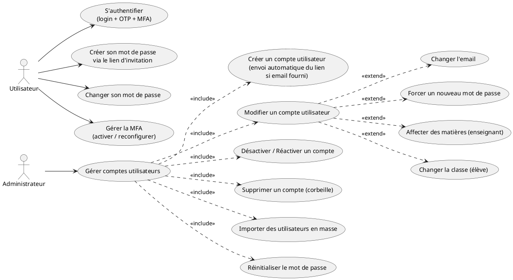
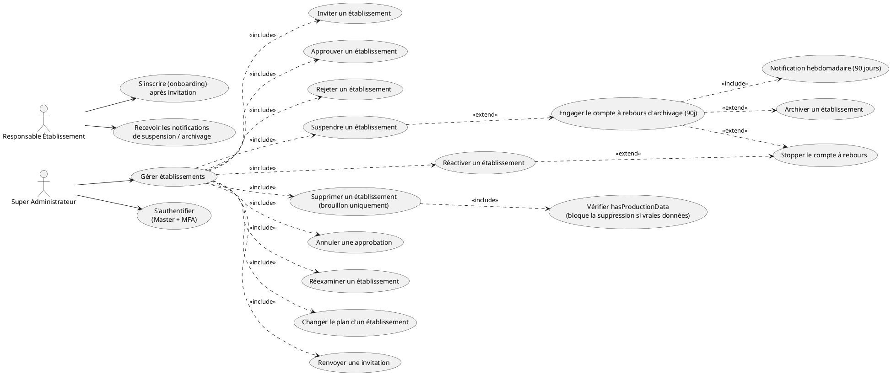
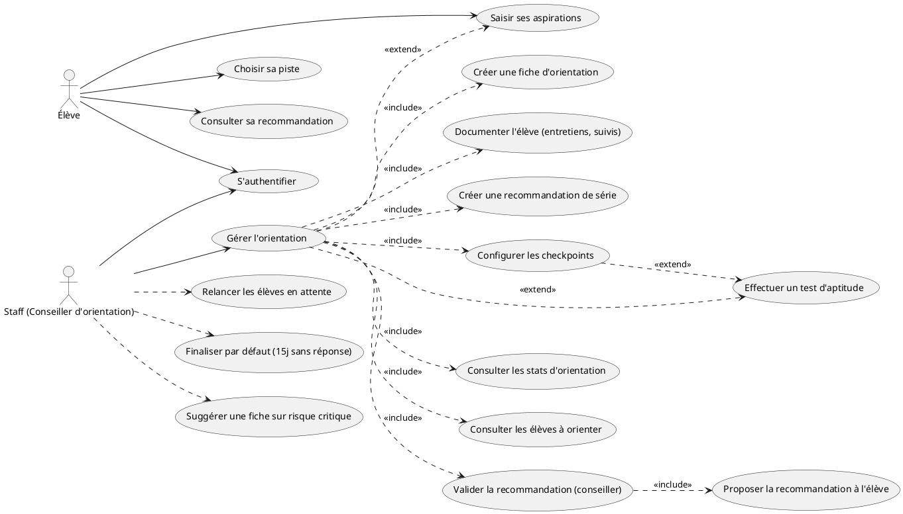

# Diagrammes de cas d'utilisation corrigés — ZEKOULABIA

> Diagrammes PlantUML vérifiés et alignés sur le code réel du backend.
> Chaque diagramme est suivi des justifications des corrections apportées.

---

## DCU — Gérer comptes utilisateurs

**Acteurs :** Administrateur (Admin), Utilisateur.



### Justifications

- **« Inviter » n'est pas un UC à part** : l'envoi du lien d'invitation est un effet de bord automatique de `register` et `import` (prod + email fourni) — voir `UserController.ts:570` et `ImporterUtilisateursUseCase.ts:406`. Pas de route « envoyer une invitation » séparée.
- **« Désactiver / Réactiver »** passe par `PUT /:id` avec `isActive` → `ModifierUtilisateurUseCase.ts:54` (réservé Admin).
- **Extensions de « Modifier »** : email (`isActive`/`email`/`passwordHash`/`subjectIds`/`classeId`), toutes réservées Admin sauf le self-service `change-password`.
- **`S'authentifier` en UC autonome** : précondition globale (login + OTP + MFA), pas une sous-fonction de la gestion.

---

## DCU — Gérer établissements

**Acteurs :** Super Administrateur (Master), Responsable Établissement.



### Justifications

- **« Créer » → « Inviter »** : le Super Admin ne crée jamais une école directement — il invite (`POST /schools/invite`), puis l'école s'inscrit elle-même via `POST /register` (acteur Responsable Établissement).
- **`<<extend>>` du cycle suspendu → archivé** :
  - `UC4 ..> E1` : engager le compte à rebours est **optionnel**, seulement depuis une suspension — comportement conditionnel.
  - `E1 ..> E2` : l'archivage n'arrive **que si** 90 jours s'écoulent sans réaction.
  - `UC5 ..> E3` et `E1 ..> E3` : stopper le compte à rebours est une **variante optionnelle** de la réactivation (ou du compte à rebours en cours).
  - `E1 ..> E4` : la notification hebdomadaire est **obligatoire** une fois le compte à rebours engagé (`include`).
- **`Supprimer` → « brouillon uniquement »** : `hasProductionData` (élèves avec bulletin publié OU paiement enregistré) bloque toute suppression (409) — garde-fou **obligatoire** (`UC6 ..> G1 : include`). Un brouillon sans données peut être supprimé en dur.
- **Cycle de vie cible** : `DRAFT → PENDING → APPROVED → ACTIVE → SUSPENDED → ARCHIVED`, ou `SUSPENDED → ACTIVE` (réactivation). Ajout du statut `ARCHIVED` à l'enum (`schema.prisma:2210`).
- **`motif` obligatoire** pour suspendre / réactiver / archiver (déjà en place pour `reject`, `MasterAdminHexController.ts:84`).
- **`S'authentifier` extrait** de l'include : précondition globale (Master + MFA obligatoire), pas une sous-fonction.
- **`requireMasterSensitiveAuth`** : toutes les actions « décisives » (inviter, rejeter, suspendre, supprimer…) exigent une vérification d'identité renforcée.

### Changements schéma requis

```prisma
enum SchoolStatus {
  DRAFT
  PENDING
  APPROVED
  ACTIVE
  REJECTED
  SUSPENDED
  ARCHIVED            // ← ajout
}

model School {
  // ajouts :
  suspensionMotif       String?    // motif obligatoire à la suspension
  archiveCompteARebours DateTime?  // date limite de compte à rebours (null = pas engagé)
  archiveMotif          String?
  archiveNotifDerniere  DateTime?  // dernier push hebdo 90j
}
```

---

## DCU — Gérer orientation

**Acteurs :** Staff (Conseiller d'orientation), Élève.

Le module a **deux workflows** distincts : un manuel (fiche + entretiens) et un **moteur de checkpoints** automatique (fin 3ème / fin Seconde C) où **l'élève a le dernier mot**.



### Justifications

- **Deux workflows** (`schema.prisma:2417-2431`) : manuel (`PROPOSEE → VALIDEE_ADMIN → ACCEPTEE_PARENT → TRANSMISE_DRES`) et moteur de checkpoints (`CALCULEE → VALIDEE_CONSEILLER → PROPOSEE_A_L_ELEVE → VALIDEE_ELEVE / VALIDEE_PAR_DEFAUT`).
- **Checkpoints** (`schema.prisma:2433`) : `FIN_TROISIEME` (3ème→Seconde, A/SES/C) et `FIN_SECONDE_C` (Seconde C→Première, C/D/TI).
- **`<<include>>` du workflow B** : ordre obligatoire (`W2 → W3`), pas de saut possible. **La génération est exclue du diagramme** : c'est une action **automatique** (cron quotidien 7h, `functions.ts:1360`), pas un UC d'acteur — le Staff n'appuie pas sur un bouton « générer ».
- **`<<extend>>`** :
  - `UC ..> E1` : le test d'aptitude alimente le calcul **s'il est présent** (optionnel par école, `psychotechnicalTestRequired` défaut `false`).
  - `UC4 ..> E1` : la config **déclenche** l'exigence du test — deux `<<extend>>` qui racontent les deux côtés (déclenchement + alimentation).
  - `UC ..> E2` : les aspirations de l'élève alimentent le calcul **si saisies**.
- **Jobs automatiques** (`functions.ts:1360`, cron quotidien 7h) : relancer, finaliser par défaut, suggérer sur risque critique — le Staff est destinataire/notifié, pas déclencheur.
- **`S'authentifier` extrait** : précondition globale, pas une sous-fonction de la gestion.